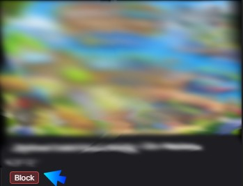
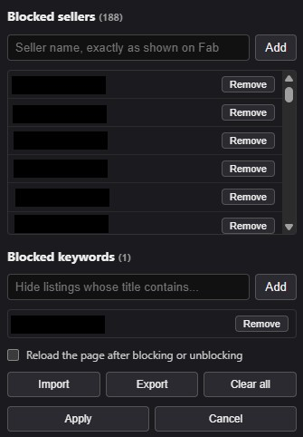

# Fab Seller Blocklist

FAB is flooded with practically useless assets that makes discovery of nice assets almost impossible.

With this browser extension you can easily block sellers so they never show up when browsing FAB.

I don't understand why FAB didn't make this feature or curate their marketplace more. The argument of empowering creators doesn't hold up when the actual proper creators drown in trash.

## Block sellers

Hover a seller's name → click **Block**.

## Manage your list

Open the extension's toolbar icon. Add/remove sellers, block keywords, or import/export lists.

Lists stay in this browser; use export/import to move them. Existing lists migrate automatically.

## Install

For **Chrome, Edge, Brave, and Opera** (Chromium). Firefox/Safari not supported.

1. **Code → Download ZIP**, then extract and keep the folder.
2. Open your browser's **Extensions** page → enable **Developer mode**.
3. **Load unpacked** → select the extracted folder containing `manifest.json`.

After updating or reloading the extension, refresh any open Fab tabs too. An
"Extension context invalidated" error means the tab is still running the old
copy of the extension; refresh the Fab page and retry the action. Your saved
blocklist stays in browser storage.

Unofficial; not affiliated with Epic Games.
